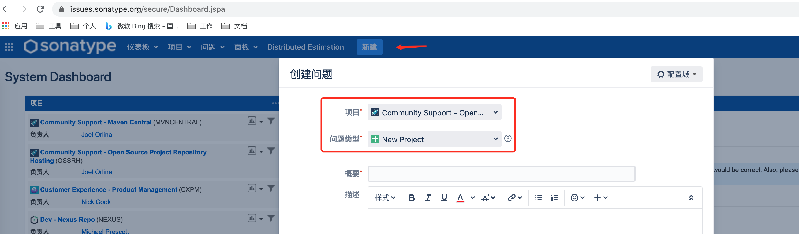
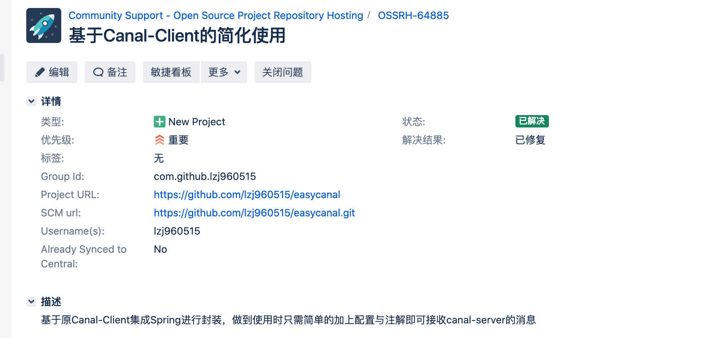
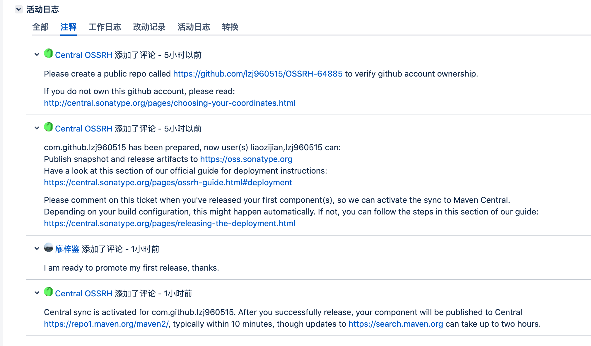
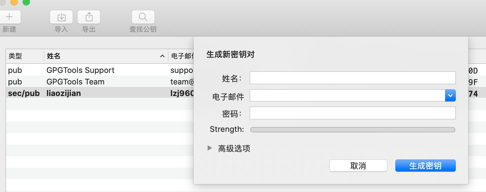
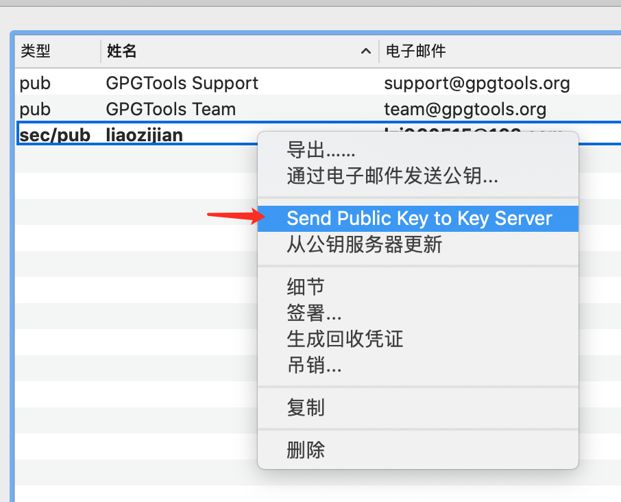
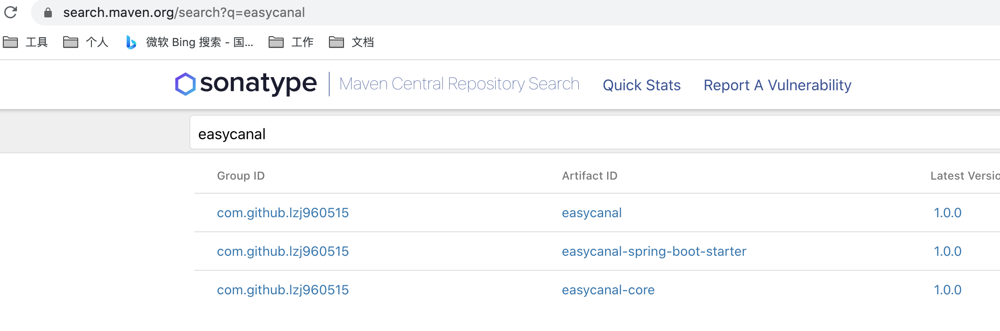

# 如何发布Java项目到Maven中央仓库

本文主要记录了「发布Java项目到Maven中央仓库」这一过程。大概分为以下步骤：

- 准备一个项目并发布到`github`上
- 去[https://issues.sonatype.org](https://issues.sonatype.org/)建立工单
- 将项目发布到https://oss.sonatype.org
- 最后在https://search.maven.org/查询项目是否发布到Maven中央仓库

## 准备

首先，我们需要准备一个Java项目，最好是发布在代码托管平台上，比如**github**, `gourpId`格式为`com.github.<你的用户名>`，例如我的github帐号为`lzj960515`，所以我的项目配置如下：

```xml
<groupId>com.github.lzj960515</groupId>
<artifactId>easycanal</artifactId>
<version>1.0.0</version>
<packaging>pom</packaging>

<name>${project.artifactId}</name>
<description>easycanal</description>
<url>https://github.com/lzj960515/easycanal</url>
```

> 因为最后发布项目时需要name、description、url这三样，所以这里也索性写上了。

## 建立工单

有了项目，我们还要去[https://issues.sonatype.org](https://issues.sonatype.org/)建立工单，负责申请上传资格及完成第一次上传。

### 新建一个工单

注册并登陆到https://issues.sonatype.org，新建一个Issue



> 项目和问题类型如图所示

建立好后的样例如下：



### 处理工单

建立完之后底下将会有回应，情况如下：



1. 最开始时会告诉你需要到github上建立一个与工单名相同的仓库，用来验证你是否为该项目的拥有者，建立好之后点击工单上的`respond`按钮。

2. 再等一会就会告诉你可以发布到构件仓库了：[https://oss.sonatype.org](https://oss.sonatype.org/)

3. 发布之后添加一条评论，这时就会将发布好之后的jar包同步到中央仓库中，差不多需要等2个小时。

> 发布之后就可以在[https://oss.sonatype.org](https://oss.sonatype.org/)看到相应的jar包了，两个小时后可以去https://search.maven.org/查找是否发送到Maven中央仓库（可能更久）

## 发布项目

上面记录了大致的流程，那么发布项目具体应该怎么做呢？

### 配置GPG密钥

因为我们需要通过`maven-gpg-plugin`发布项目，所以首先我们需要生成一份自己的GPG密钥。

1. 下载安装相关工具

   进入下载地址并选择相应系统的工具：https://www.gnupg.org/download/

   我这里是mac，下载内容如下图，第一个是可视化工具，第二个是真正生成密钥的安装包

   

2. 生成密钥

   打开`GPG Keychain`工具，点击**新建**，输入自己的相关信息后生成密钥

   

3. 发送公钥到服务器

   

### 配置Maven

1. 在Java项目的`pom.xml`中添加`licenses`，`scm`，`developers`相关信息

   ```xml
   <licenses>
     <license>
       <name>The Apache Software License, Version 2.0</name>
       <url>http://www.apache.org/licenses/LICENSE-2.0.txt</url>
       <distribution>repo</distribution>
       <comments>A business-friendly OSS license</comments>
     </license>
   </licenses>
   
   <scm>
     <tag>main</tag>
     <url>https://github.com/lzj960515/easycanal.git</url>
     <connection>scm:git:https://github.com/lzj960515/easycanal.git</connection>
     <developerConnection>scm:git:git@github.com:lzj960515/easycanal.git</developerConnection>
   </scm>
   
   <developers>
     <developer>
       <name>Zijian Liao</name>
       <email>lzj960515@163.com</email>
       <url>zijiancode.cn</url>
     </developer>
   </developers>
   ```

2. 在Java项目的`pom.xml`中配置相应的插件

   一共需要4个插件

   - `maven-source-plugin`用于生成Source Jar文件
   - `maven-javadoc-plugin` 用于生成 javadoc 文档
   - `maven-gpg-plugin` 用于对工程文件进行签名
   - `nexus-staging-maven-plugin` 用于将工程发布到中央仓库

   ```xml
   <!-- Source -->
   <plugin>
     <groupId>org.apache.maven.plugins</groupId>
     <artifactId>maven-source-plugin</artifactId>
     <version>3.2.1</version>
     <executions>
       <execution>
         <phase>package</phase>
         <goals>
           <goal>jar-no-fork</goal>
         </goals>
       </execution>
     </executions>
   </plugin>
   <!-- Javadoc -->
   <plugin>
     <groupId>org.apache.maven.plugins</groupId>
     <artifactId>maven-javadoc-plugin</artifactId>
     <version>3.2.0</version>
     <executions>
       <execution>
         <phase>package</phase>
         <goals>
           <goal>jar</goal>
         </goals>
         <configuration>
           <doclint>none</doclint>
         </configuration>
       </execution>
     </executions>
   </plugin>
   <!-- GPG -->
   <plugin>
     <groupId>org.apache.maven.plugins</groupId>
     <artifactId>maven-gpg-plugin</artifactId>
     <version>1.6</version>
     <configuration>
       <useAgent>false</useAgent>
     </configuration>
     <executions>
       <execution>
         <phase>verify</phase>
         <goals>
           <goal>sign</goal>
         </goals>
       </execution>
     </executions>
   </plugin>
   <!-- Nexus Staging Maven -->
   <plugin>
     <groupId>org.sonatype.plugins</groupId>
     <artifactId>nexus-staging-maven-plugin</artifactId>
     <version>1.6.7</version>
     <extensions>true</extensions>
     <configuration>
       <serverId>oss</serverId>
       <nexusUrl>https://oss.sonatype.org/</nexusUrl>
       <autoReleaseAfterClose>true</autoReleaseAfterClose>
     </configuration>
   </plugin>
   ```

3. 配置Maven的`setting.xml`文件

   ```xml
   <servers>  
   	<server>
       <!-- id需要和pom.xml中的nexus-staging-maven-plugin的serverId相同 -->
         <id>oss</id>
         <username>gpg的帐户名</username>
         <password>gpg的密码</password>
       </server>
   </servers>
   
   <!-- Mac 需要单独增加该配置 -->
   <properties>
     <gpg.executable>gpg2</gpg.executable>
     <gpg.passphrase>1qaz@WSX0okm(IJN</gpg.passphrase>
   </properties>
   ```

4. 使用Maven命令发布项目

   ```shell
   mvn clean deploy -Dmaven.test.skip=true
   ```

   > 如果需要指定Maven环境，可以使用` -P 环境名` 
   >
   > 如果有不需要发布的模块可使用`mvn -pl '!easycanal-samples,!com.github.lzj960515:easycanal-sample-spring-boot' clean deploy -Dmaven.test.skip=true`，`-pl`表示项目列表，`![gourpId:]artifactId表示忽略某个项目`，`[gourpId:]`可加可不加，如果需要忽略某个模块的子模块则必须加上，如`!com.github.lzj960515:easycanal-sample-spring-boot`

## 查询项目

发布完之后可以直接到https://oss.sonatype.org上查询项目发布情况

等待几个小时后才可在https://search.maven.org/查询项目是否发布到Maven中央仓库



## 版本更新

项目版本更新后，直接执行发布命令即可`mvn clean deploy -Dmaven.test.skip=true`，不必再建立issue，等待一段时间，会自动同步到中央仓库。